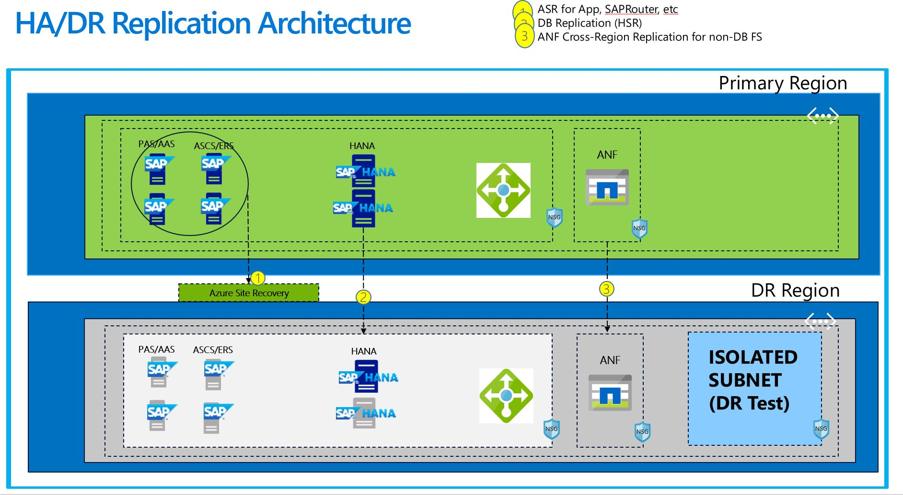

## ASR Powershell Automation for SAP Application Servers, ASCS, SAPRouters, etc

### Requirements:

* Azure Subscription
* https://shell.azure.com
* PowerShell 7.1 or newer - if you are running it from Visual Code
* PowerShell modules Az - if you are running it from Visual Code

### More about these scripts:
* Leverage ASR-Infra-Setup.ps1 to setup Recovery Vault Infrastructure - One time activity
  * Go to Recovery Vault -> Site Recovery infrastructure -> Extension update settings and manually enable "Allow Site Recovery to manage". This setting is highly recommended. 
* This script "ASR-MultiVM-SAP.ps1" has got three functions such as
  * enable
  * test
  * cleanup
* You can run "ASR-MultiVM-SAP.ps1" in one of the three modes, start with enable and proceed with test and finally cleanup. 
* These two PS scripts require number of parameters, part of input file. See Input Parameter section for more details.
* All VMs must reside within same RG.
* Script capture source VM OS/Data Disks, NIC accelerated settings, AvSet and sets up both test and recovery settings accordingly.
* Script also creates a Recovery Plan.
* Re-Running of the script typically skips already protected VMs but you can include new set of VMs that can be protected. Each rerun will update NIC & Recovery plan. 
* VM Size, OS, Data Disks and AvSet settings are created part of initial run for each VM and rerun does not update these values after initial run.
* This script can be updated to include PPG, AvZones & other ASR features.

### SAP on Azure - HA/DR High Level Architecture



### Preparing Input file:

If Recovery Vault Infrastructure is already created then you can leverage [Azure Resource Explorer](https://resources.azure.com/) to locate all required parameters by drill-down to Recovery Services section. 

Fill-out csv file named "asr_input_parameters.csv 

### Input parameter details: 
```
Parameter Name              Description 

SubscriptionName            Subscription Name 
region                      Primary Region 
drregion                    DR Region
rv_name                     Recovery Vault Name
rv_rg                       Resource Group of Recovery Vault 
fabric_name                 Primary Region Fabric Name
dr_fabric_name              DR Region Fabric Name 
prot_name                   Primary Region Protection Container Name 
dr_prot_name                DR Region Protection Container Name
a2a_policy                  A2A Replication Policy Name 
a2a_pri_to_dr               A2A Mapping Name 
primary_sa_rg               Primary Region Cache storage account resource group name
primary_sa_acc              Primary Region Cache storage account 
vnet                        Primary Region vnet name 
vnet_rg                     Primary Region vnet resource group name 
drvnet                      DR Region vnet name 
drvnet_test                 DR Region test vnet name 
drsubnet_test               DR Region test subnet name 
drsubnet_primary            DR Region subnet name 
drvnet_rg                   DR vnet resource group name
vmlist                      List of SAP PAS, AAS, ASCS VMs
vm_rg_name                  Resource Group name for the VMs 

```
### Sample Output for "enable" : 

```
ASR-MultiVM-SAP.ps1 .\asr_input_parameters.csv

Importing file content : ..\asr_input_parameters.csv
Source VM Resource Group Name : sapapp3
Following VM will be considered for ASR :
sapapp6
Following recovery plan name will be created or used : sapapp3-recovery-plan
Selecting Subscription : xx

Name                                     Account                 SubscriptionName        Environment             TenantId
----                                     -------                 ----------------        -----------             --------
xxx (xxx)                                xxx@xxx.com                xxx                    AzureCloud              xxx 
Checking if DR Resource Group : sapapp3-asr exists or create
Creating resource group sapapp3-asr
Recovery VM Resource Group Name : sapapp3-asr
Recovery Vault Name : rvname-v2
Primary Fabric Name : fabric-v2
Recovery Fabric Name : drfabric-v2
Primary Protection Container Name : container-v2
Recovery Protection Container Name : drcontainer-v2
Mapping between the Primary and Recovery Protection Containers : a2apolicy-v2
Recovery vnet name  : /subscriptions/xxx/resourceGroups/infra-eastus-rg/providers/Microsoft.Network/virtualNetworks/sapvnet-wus2
Primary vnet name  : /subscriptions/xxx/resourceGroups/azsap/providers/Microsoft.Network/virtualNetworks/azsapspoke
Enter one of the options:  enable, test, cleanup, exit to continue: enable
Enabling VM replication, creating or updating Recovery Plan and updating individual VM NIC configuration
Enabling Replication for VM sapapp6
Checking and Creating AvSet based on source VM configuration
Check Recovery Vault -> Site Recovery jobs section for VM sapapp6
ASR Job Status : InProgress
Checking for VM Protection progress and takes 15-20 minutes to see % completion progress
Enabling Protection could take minutes to few hours and depends on data volume
Date                ; VM Name        ;  Protection Current State  ;   % Completion
04/13/2021 20:47:04 ; sapapp6 ;  Enabling protection ;
...
04/13/2021 21:15:33 ; sapapp6 ;  Enabling protection ; 0
04/13/2021 21:16:06 ; sapapp6 ;  Enabling protection ; 0
...
04/13/2021 21:22:07 ; sapapp6 ;  Enabling protection ; 56
04/13/2021 21:22:39 ; sapapp6 ;  Enabling protection ; 56
04/13/2021 21:27:00 ; sapapp6 ;  Enabling protection ; 69
04/13/2021 21:36:51 ; sapapp6 ;  Enabling protection ; 80
04/13/2021 21:37:24 ; sapapp6 ;  Enabling protection ; 93
04/13/2021 21:44:31 ; sapapp6 ;  Enabling protection ; 93
ASR Protected VM:  sapapp6
Checking if Recovery Plan exists
Creating Recovery Plan sapapp3-recovery-plan
Recovery Plan create job status : Succeeded
Updating NIC for sapapp6
NIC setting update job status : Succeeded for sapapp6
Check Site Recovery jobs section if all jobs successfully completed
Manually verify Compute and Network Settings in Azure Portal if Configured with Isolated subnet for Test Failover section , before doing DR Test
Login to Azure portal and verify recovery plan and VM network settings are created as expected

```

### Sample Output for ASR One-time "setup" : 
```
.\ASR-Infra-Setup-v1.ps1 .\asr_input_parameters-v2.csv

Importing file content : .\asr_input_parameters-v2.csv
Selecting Subscription : XXX

Name                                     Account                 SubscriptionName        Environment             TenantId
----                                     -------                 ----------------        -----------             --------
XXX (XXX) 				XXX@XXX.com  			XXX 		   AzureCloud              XXX 
Checking if DR Resource Group : rv-rg-v2 exists or create
Resource group rv-rg-v2 already exist
Create Recovery Vault - rvname-v2

ResourceName      : rvname-v2
ResourceGroupName : rv-rg-v2
ResourceNamespace : Microsoft.RecoveryServices
ResouceType       : vaults

Create ASR fabric in Primary Region - ASR Job status : Succeeded
Create ASR fabric in DR Region - ASR Job status : Succeeded
Create Protection Container in the Primary Region - ASR Job status: Succeeded
Create Protection Container in the DR Region - ASR Job status: Succeeded
Create Replication Policy - ASR Job status : Succeeded
Create Protection container mapping between the Primary and Recovery with Replication policy - ASR Job status : Succeeded
Recovery vnet /subscriptions/XXX/resourceGroups/infra-eastus-rg/providers/Microsoft.Network/virtualNetworks/sapvnet-wus2
Primary vnet /subscriptions/XXX/resourceGroups/infra-eastus-rg/providers/Microsoft.Network/virtualNetworks/sapvnet-wus2
ASR network mapping between the primary Azure virtual network and the recovery Azure virtual network - ASR Job status : Succeeded

```
### Sample Output for ASR "test" : 
```
.\ASR-MultiVM-SAP.ps1 .\asr_input_parameters-v2.csv
Importing file content : ..\asr_input_parameters-v2.csv
Source VM Resource Group Name : sapapp3
Following VM will be considered for ASR :
sapapp6
...
Enter one of the options:  enable, test, cleanup, exit to continue: test
Following VM, vnet and subnet will be used for DR Test that are part of Recovery Plan : sapapp3-recovery-plan
Test VM Name : sapapp6-test
vnet : sapvnet-wus2
subnet : isolated

Manually verify Compute and Network Settings in Azure Portal if it points to Isolated subnet for Failover Network, before entering continue or exit: continue
DR test is in progress
Login to azure portal and check if VMs are being deployed inside Isolated Subnet
 ASR test jobs status : InProgress - 04/13/2021 22:30:27
 ASR test jobs status : InProgress - 04/13/2021 22:30:49
 ...
 ASR test jobs status : InProgress - 04/13/2021 22:32:37
 ASR test jobs status : Succeeded - 04/13/2021 22:32:58
Verify one more time if VMs are deployed inside Isolated Subnet before continue with DR test activities
```

### Sample Output for ASR "cleanup" : 
```
.\ASR-MultiVM-SAP.ps1 .\asr_input_parameters-v2.csv
Importing file content : ..\asr_input_parameters-v2.csv
Source VM Resource Group Name : sapapp3
Following VM will be considered for ASR :
sapapp6
...
Enter one of the options:  enable, test, cleanup, exit to continue: cleanup
DR test resources cleanup in progress for Recovery Plan : sapapp3-recovery-plan
 ASR cleanup job state and description : InProgress ; InProgress - 04/13/2021 22:35:24
Check ASR job section for job status and VM deletion progress
...
 ASR cleanup job state and description : Succeeded ; Completed - 04/13/2021 22:37:31
Check ASR job section for job status and VM deletion progress
```

### Reference documentation:
[Powershell module for Azure Recovery Services](https://docs.microsoft.com/en-us/powershell/module/az.recoveryservices/?view=azps-5.8.0#recovery-services) \
[ASR Powershell automation](https://docs.microsoft.com/en-us/azure/site-recovery/azure-to-azure-powershell)